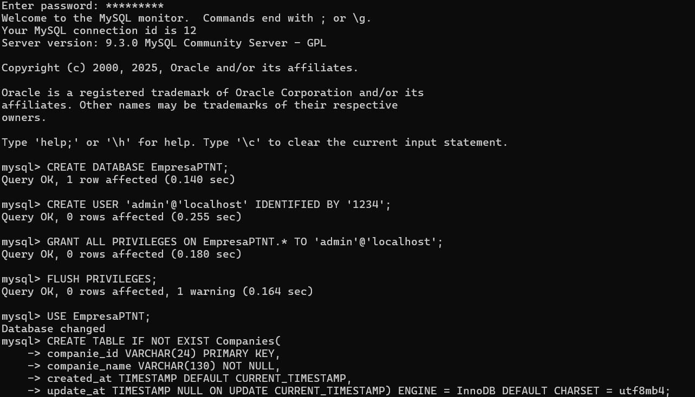
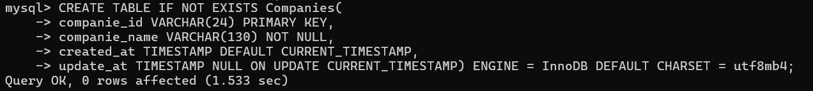
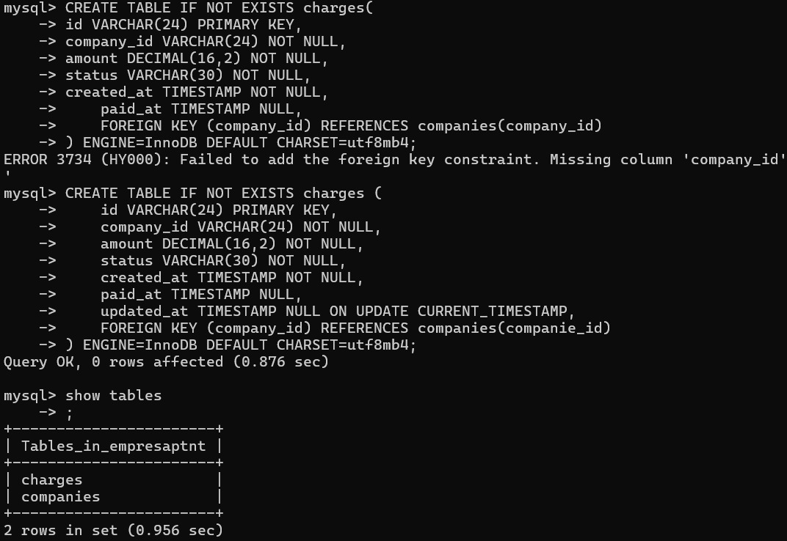
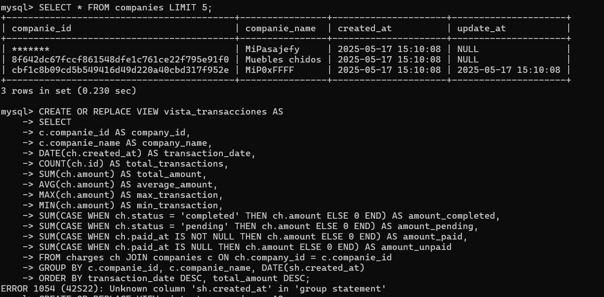
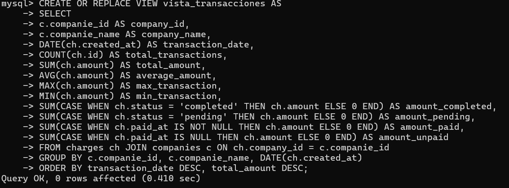
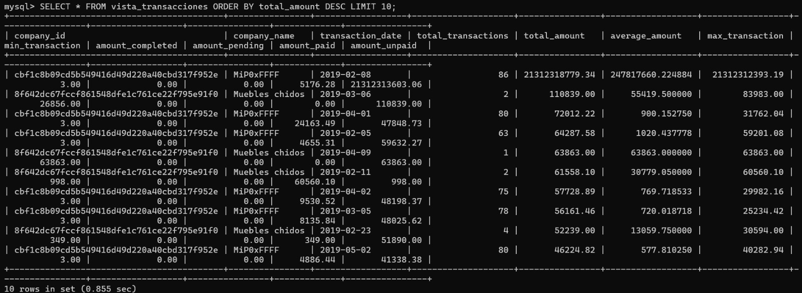
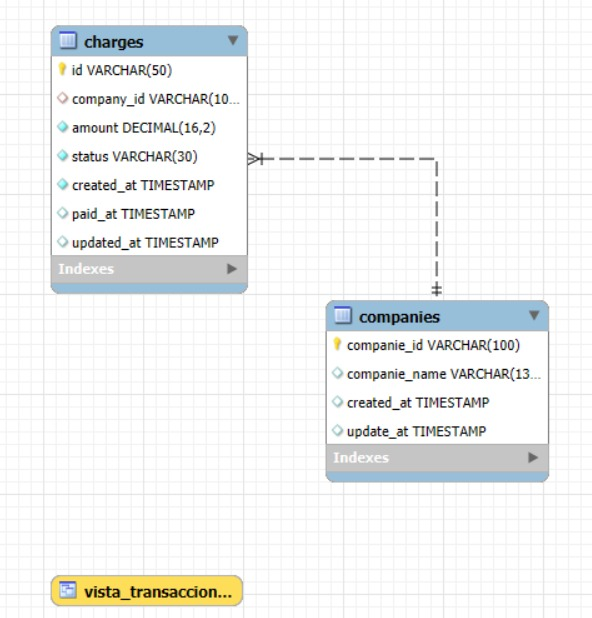

Se adjuntan las imagenes de la creacion de la base de datos hecha en CLI MySQL
y las notas pedidas en el Word.

## Capturas de la implementación

### 1. Creación de la base de datos

### 2. Tabla companies

### 3. Tabla charges

### 4. Prueba de consulta

### 5. Vista SQL

### 6. Prueba de la vista

## Incluye comentarios del por qué elegiste ese tipo de base de datos.

Utilice MySQL por que para la implementacion era adcecuada una base de datos de tipo relacional para su estructura, en este caso es bueno tener relacionada la tabla charges con la de companies para poder generar vistas mejor estructuradas

## Agrega comentarios acerca del por qué tuviste que utilizar el lenguaje y el formato que elegiste. También platicamos si te encontraste con algún reto a la hora de extraer la información.

Utilice python por 2 principales razones, la primera es que su biblioteca de pandas es la mejor eleccion a mi criterio de manejar archivos como cssv
y la segunda porque es el lenguaje que el puesto de trabajo requiere.

El principal problema es  la falta de metadata como algunas vacias o los tipos de dato entre otras lo que genero errores al momento de hacer el codigo, sin embargo con las adecuadas configuraciones en el script de python se pueden evitar esos problemas, puede que no haya considerado todas.

## Incluye comentarios acerca de que transformaciones tuviste que realizar y que retos te encontraste en la implementación de estos mecanismos de transformación.

En realidad no fueron muchos, mas que nada ordenar los elementos y agruegar lo de las fechas de actualizacion y creacion. Mas que nada estandarizar los datos 

## Incluye el diagrama de base de datos resultado de este ejercicio.

Utilice workbench para hacer el diagrama con base a la base que se hizo

## Comentarios adicionales

Se pudo haber usado contenedores en docker para este ejemmplo...
Un contenedor que almacena la bade de datos de mysql y otro el script de python para las consultas
Si fuera un sistema mas robusto esto permitiria que el software fuera escalable gracias a los microservicios
Para el desarollo de este ejercicio no contaba con Docker y no contemplaba que me fuera a dar tiempo de hacerlo.

